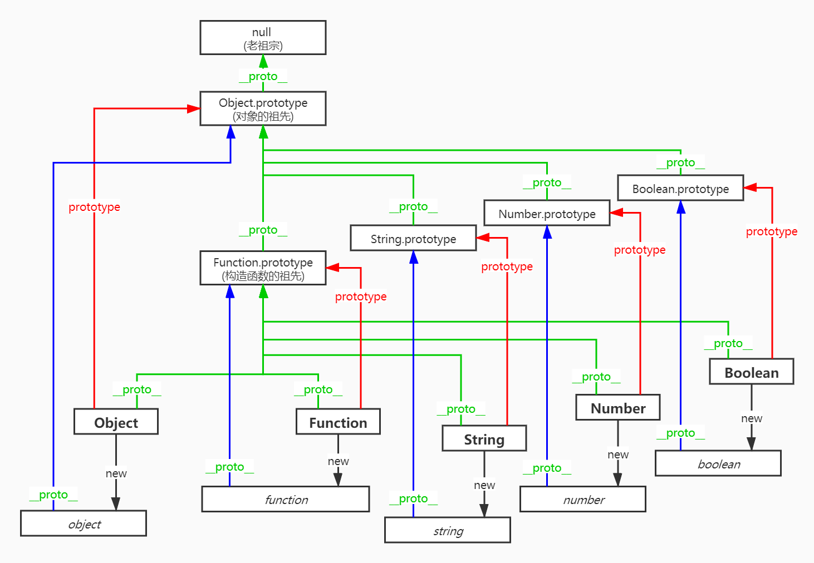

## 前言
最近在准备前端面试，看了些常考面试题，总结之。

## 手写 浅拷贝(shallowClone) 与 深拷贝(deepClone)

考查点：`值类型与引用类型`，延伸点：`内存机制`

参考：

- [[ ConardLi ] 如何写出一个惊艳面试官的深拷贝?](https://juejin.im/post/5d6aa4f96fb9a06b112ad5b1)
- [[ 鬼鬼鬼 ] JavaScript 内存机制（前端同学进阶必备）](https://juejin.im/post/5b10ba336fb9a01e66164346)
- [[ Nicholas C.Zakas ] Sets and Maps](https://leanpub.com/understandinges6/read#leanpub-auto-sets-and-maps)

```
function isObject (obj) {
  return obj !== null && typeof obj === "object";
}

function shallowClone (source) {
  if (isObject(source)) {
    const target = Array.isArray(source) ? [] : {};

    // for/while 的效率比 for...in 高
    if (Array.isArray(source)) {
      const len = source.length;
      for (let i = 0; i < len; i++) {
        target[i] = source[i];
      }
    } else {
      for (const key in source) {
        if (source.hasOwnProperty(key)) {
          target[key] = source[key];
        }
      }
    }

    return target;
  } else {
    return source;
  }
}

function deepClone (source, map = new WeakMap()) {
  if (isObject(source)) {
    const target = Array.isArray(source) ? [] : {};

    // 解决递归可能会引起的循环引用问题
    if (map.has(source)) {
      return map.get(source);
    }
    map.set(source, target);

    // for/while 的效率比 for...in 高
    if (Array.isArray(source)) {
      const len = source.length;
      for (let i = 0; i < len; i++) {
        target[i] = deepClone(source[i], map);
      }
    } else {
      for (const key in source) {
        if (source.hasOwnProperty(key)) {
          target[key] = deepClone(source[key], map);
        }
      }
    }

    return target;
  } else {
    return source;
  }
}
```

## 创建 10 个 &lt;a&gt; 标签，点击的时候弹出对应的序号

考查点：`事件冒泡`

```
const container = document.createElement('div');
for (let i = 0; i < 10; i++) {
  const link = document.createElement('a');
  link.href = '#';
  link.textContent = i.toString();
  link.setAttribute('data-id', i);
  container.append(link);
}
container.addEventListener('click', (event) => {
  if (event.target.tagName === 'A') {
    event.preventDefault();
    alert(event.target.dataset.id);
  }
});
document.body.append(container);
```

## 手写 防抖(debounce) 与 节流(throttle)

考查点：`闭包`，延伸点：`性能优化` `交互体验`

```
function debounce(fn, threshold = 250, {scope = undefined} = {}) {
  let deferTimer;
  return function () {
    const context = scope || this;
    const args = arguments;

    clearTimeout(deferTimer);
    deferTimer = setTimeout(() => {
      fn.apply(context, args);
    }, threshold);
  }
}

function throttle(fn, threshold = 250, {scope = undefined} = {}) {
  let deferTimer;
  return function () {
    const context = scope || this;
    const args = arguments;

    if (deferTimer == null) {
      deferTimer = setTimeout(() => {
        deferTimer = null;
        fn.apply(context, args);
      }, threshold);
    }
  }
}
```

## 思考 原型与原型链

参考

- [[ manxisuo ] JavaScript 世界万物诞生记](https://zhuanlan.zhihu.com/p/22989691)


```
function Person () {}

Person.prototype.__proto__ === Object.prototype;
Person.__proto__ === Function.prototype;

Function.__proto__ === Function.prototype;
// (对象Function).__proto__ === (构造函数Function).prototype
```




## 理解 作用域链与闭包

参考
- [[ mqyqingfeng ] JavaScript深入之作用域链](https://github.com/mqyqingfeng/Blog/issues/6)
- [ Kyle Simpson ] 你不知道的JavaScript（上卷） 第一部分 第1~4章
- [ Nicholas C.Zakas ] JS高程（第3版） 4.2 执行环境及作用域 7.2 闭包

```
const a = 10;

function getA() {
  const a = 20;
  
  inner();
  outer();

  function inner() {
    console.log('inner: ' + a);
  }
}

function outer() {
  console.log('outer: ' + a);
}

getA();

/*
output:

inner: 20
outer: 10
*/
```

## 理解 this 与箭头函数

参考

- [[ Nicholas C.Zakas ] Arrow Functions](https://leanpub.com/understandinges6/read#leanpub-auto-arrow-functions)
- [ Nicholas C.Zakas ] JS高程（第3版） 7.2.2 关于 this 对象

```
/* 
函数内部有一个特殊对象 this，this 引用的是函数据以执行的环境对象

this 对象是在运行时基于函数的执行环境绑定的：
在全局函数中，this 等于 window，而当函数被作为某个对象的方法调用时，this 等于那个对象
*/

var name = 'global';

var obj1 = {
  name: 'local',
  getName: function () {
    var that = this;
    return () => {
      console.log(this.name, that.name);
    }
  }
};

obj1.getName()(); // local local (非严格模式下)
```

## 手写 apply call

```
if (!Function.prototype.apply) {
  Object.defineProperty(Function.prototype, 'apply', {
    enumerable: false,
    writable: true,
    configurable: true,
    value: function () {
      const thatFn = this;
      const [that, args = []] = [...arguments];

      // ... 省略完整性判断及处理

      const key = Symbol();
      that[key] = thatFn;
      const result = that[key](...args);
      delete that[key];
      return result;
    }
  });
}
```

## 手写 bind

考查点：`this` `arguments` `闭包`，延伸点：`作用域链`

参考

- [[ MDN ] Function.prototype.bind()](https://developer.mozilla.org/zh-CN/docs/Web/JavaScript/Reference/Global_Objects/Function/bind)

```
if (!Function.prototype.bind) {
  Object.defineProperty(Function.prototype, 'bind', {
    enumerable: false,
    writable: true,
    configurable: true,
    value: function () {
      const thatFn = this;
      const [that, ...args] = [...arguments];
  
      if (typeof thatFn !== 'function') {
        throw new TypeError(`${thatFn} is not a function`);
      }
  
      return function () {
        const fnArgs = [...args, ...arguments];
        return thatFn.apply(that, fnArgs);
      }
    }
  });
}
```

## 了解 Promise

